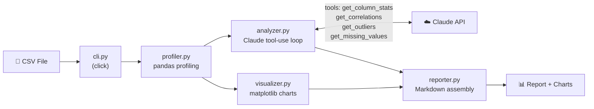

# claude-data-reporter

> **AI-powered CSV analysis and narrative report generation using Claude**

[](https://github.com/shushan/claude-data-reporter/actions/workflows/ci.yml)

[](https://github.com/astral-sh/ruff)


Drop any CSV file in, get a professional Markdown report with statistical insights, visualizations, and actionable recommendations — all generated by Claude acting as a senior data analyst.

---

## Demo

> _GIF coming soon — run the quick start below and generate your own!_

```
$ claude-data-reporter analyze examples/sample_sales.csv --verbose

Loading CSV...
  Loaded 500 rows × 12 columns.
Profiling data...
  Numeric: 4 | Categorical: 6 | Date: 1 | Missing: 2.8%
Generating charts...
  7 chart(s) saved to output/
Analyzing with Claude (this may take 30–60 seconds)...
Writing report...

Analysis complete!
Report saved to: output/report_sample_sales_20250514_120000.md
Charts saved to: output/
```

---

## Quick Start

```bash
# 1. Clone and install
git clone https://github.com/shushan/claude-data-reporter.git
cd claude-data-reporter
pip install -e ".[dev]"

# 2. Set your API key
cp .env.example .env
# Edit .env and add: ANTHROPIC_API_KEY=sk-ant-...

# 3. Generate sample data
python examples/generate_sample_data.py

# 4. Analyze!
claude-data-reporter analyze examples/sample_sales.csv --verbose
```

---

## Usage

```
claude-data-reporter analyze <CSV_PATH> [OPTIONS]

Arguments:
  CSV_PATH    Path to the CSV file to analyze

Options:
  -o, --output-dir TEXT   Output directory (default: output/)
  -m, --model TEXT        Claude model ID
  --no-charts             Skip chart generation
  -v, --verbose           Show detailed progress
  --version               Show version and exit
  --help                  Show this message and exit
```

### Examples

```bash
# Basic analysis
claude-data-reporter analyze data.csv

# Save to custom directory
claude-data-reporter analyze data.csv --output-dir reports/

# Skip charts (faster, report only)
claude-data-reporter analyze data.csv --no-charts

# Use a specific Claude model
claude-data-reporter analyze data.csv --model claude-opus-4-6
```

---

## How It Works



### The Tool-Use Pattern

The core of this project is the **Claude tool-use loop** in `analyzer.py`:

1. Claude receives a high-level dataset summary (shape, column types, missing %)
2. Claude calls specialized tools to drill into specific statistics — column distributions, correlations, outliers, missing values
3. The profiler executes each tool call and returns JSON results
4. Claude uses those results to write a structured, quantified analysis
5. The report generator assembles everything into a clean Markdown document

This mimics how a real analyst works: start broad, investigate specific areas, then synthesize findings.

---

## Example Output

```markdown
# Data Analysis Report — `sample_sales.csv`

> Generated: 20250514 12:00:00 UTC
> Dataset: 500 rows × 12 columns | Missing: 2.8%

## 1. Executive Summary

This e-commerce sales dataset spans 12 months of transaction data across 5 product
categories and 5 geographic regions. Total revenue of $1.24M is driven primarily by
Electronics (38% of revenue) despite representing only 22% of order volume, indicating
significantly higher average order values in that category...

## 2. Key Findings

1. Electronics generates 38% of total revenue despite 22% of order volume — AOV is
   2.3× the platform average ($312 vs $136).
2. The West region accounts for 29% of orders but 34% of revenue, suggesting a higher
   willingness to pay.
3. Discount rates above 20% correlate with a 3.2× increase in return rate (r = 0.71).
4. 14 orders (2.8%) have missing quantity values — concentrated in Q4, suggesting a
   data pipeline issue during peak season.
5. Unit price follows a log-normal distribution (skewness = 2.1) with 23 outliers
   above $800 — all in Electronics.
```

---

## Project Structure

```
claude-data-reporter/
├── src/
│   ├── cli.py          # Click entry point
│   ├── profiler.py     # Pandas data profiling + tool handlers
│   ├── visualizer.py   # matplotlib/seaborn chart generation
│   ├── analyzer.py     # Claude API tool-use loop
│   ├── reporter.py     # Markdown report assembly
│   └── utils.py        # Helper functions
├── tests/              # pytest suite (Claude API always mocked)
├── examples/           # Sample data + generation script
├── docs/               # Architecture and learning notes
└── output/             # Generated reports and charts
```

---

## Built With

| Tool | Purpose |
|------|---------|
| [Claude API](https://docs.anthropic.com/) | AI analysis via tool-use pattern |
| [Anthropic Python SDK](https://github.com/anthropics/anthropic-sdk-python) | API client |
| [pandas](https://pandas.pydata.org/) | Data profiling and manipulation |
| [matplotlib](https://matplotlib.org/) + [seaborn](https://seaborn.pydata.org/) | Chart generation |
| [click](https://click.palletsprojects.com/) | CLI interface |
| [python-dotenv](https://github.com/theskumar/python-dotenv) | Environment variable management |
| [pytest](https://pytest.org/) | Testing |
| [ruff](https://github.com/astral-sh/ruff) | Linting and formatting |

---

## Running Tests

```bash
# Run all tests
pytest tests/ -v

# With coverage report
pytest tests/ --cov=src --cov-report=term-missing

# Run a specific test module
pytest tests/test_profiler.py -v
```

Tests mock the Claude API — no API key required to run the test suite.

---

## What I Learned

> _I'll fill this in as I complete the project — this section will cover:_
> - How Claude's tool-use pattern differs from simple prompt engineering
> - Why `matplotlib.use("Agg")` is critical in headless environments
> - Designing structured output parsing for LLM responses
> - Building a clean Python CLI with click
> - Writing testable code when one layer calls an external API

---

## Other Portfolio Projects

> _Links to other projects coming soon_

---

## Contributing

This is a portfolio project, but issues and suggestions are welcome! Open an issue or submit a PR.

---

## License

MIT — see [LICENSE](LICENSE).

---

_Built with [Claude Code](https://claude.ai/code) — see [CLAUDE.md](CLAUDE.md) for AI context configuration._
